# I2C Timing on the i.MX RT1062 (Teensy 4)
The Teensy 4 is an `i.MX RT1062` processor. This document describes the
`i.MX RT1062`'s implementation of the I2C Specification. Its behaviour
is controlled by various registers.

This document defines the relationship between the timing parameters
in the I2C Specification and the `i.MX RT1062` registers. It:

* lists the `i.MX RT1062` registers that affect the parameter
* gives equations to calculate the parameter from the registers
* shows the difference between times measured with `BusRecorder`
  and the I2C Specification

Other documents cover the `i.MX RT1062` [pin configuration](pin_configuration.md)
and the [actual values](default_i2c_profile.md) for the I2C parameters
used in this driver.

# Table of Contents
<!-- TOC -->
* [I2C Timing on the i.MX RT1062 (Teensy 4)](#i2c-timing-on-the-imx-rt1062-teensy-4)
* [Table of Contents](#table-of-contents)
* [References](#references)
  * [i.MX RT1062](#imx-rt1062-references)
  * [I2C Specification](#i2c-specification-references)
* [Symbols and Units](#symbols-and-units)
  * [Symbols from the Datasheet](#symbols-from-the-datasheet)
  * [Additional Symbols](#additional-symbols)
* [Measuring and Comparing Durations](#measuring-and-comparing-durations)
  * [How the I2C Specification Specifies Durations](#how-the-i2c-specification-specifies-durations)
  * [How the Datasheet Defines Durations](#how-the-datasheet-defines-durations)
  * [How the BusRecorder Measures Durations](#how-the-busrecorder-measures-durations)
  * [How I2CTimingAnalyser Reports Durations](#how-i2ctiminganalyser-reports-durations)
  * [When the i.MX RT1062 Detects Edges](#when-the-imx-rt1062-detects-edges)
  * [When Other Devices Detect Edges](#when-other-devices-detect-edges)
* [i.MX RT 1060 Registers](#imx-rt-1060-registers)
  * [LPI2C Clock](#lpi2c-clock)
  * [I2C Master Registers](#i2c-master-registers)
  * [I2C Slave Registers](#i2c-slave-registers)
* [I2C Timing Parameters and Calculations](#i2c-timing-parameters-and-calculations)
  * [Variables Defined in i.MX RT1062 Datasheet](#variables-defined-in-imx-rt1062-datasheet)
    * [SCALE](#scale)
    * [SDA_RISETIME](#sda_risetime)
    * [SCL_RISETIME](#scl_risetime)
    * [SDA_LATENCY](#sda_latency)
    * [SCL_LATENCY](#scl_latency)
  * [SCL Clock Frequency](#scl-clock-frequency)
    * [f<sub>SCL</sub> SCL Clock Frequency](#fsubsclsub-scl-clock-frequency)
    * [t<sub>LOW</sub> LOW Period of the SCL Clock](#tsublowsub-low-period-of-the-scl-clock)
    * [t<sub>HIGH</sub> HIGH Period of the SCL Clock](#tsubhighsub-high-period-of-the-scl-clock)
  * [Start and Stop Conditions](#start-and-stop-conditions)
    * [t<sub>SU;STA</sub> Setup Time for a Repeated START Condition](#tsubsustasub-setup-time-for-a-repeated-start-condition)
    * [t<sub>HD;STA</sub> Hold Time for a START or Repeated START Condition](#tsubhdstasub-hold-time-for-a-start-or-repeated-start-condition)
    * [t<sub>SU;STO</sub> Setup Time for STOP Condition](#tsubsustosub-setup-time-for-stop-condition)
    * [t<sub>BUF</sub> Bus Free Time Between a STOP and START Condition](#tsubbufsub-bus-free-time-between-a-stop-and-start-condition)
  * [Data Bits](#data-bits)
    * [t<sub>SU;DAT</sub> Data Setup Time](#tsubsudatsub-data-setup-time)
    * [t<sub>HD;DAT</sub> Data Hold Time](#tsubhddatsub-data-hold-time)
    * [t<sub>VD;DAT</sub> Data Valid Time](#tsubvddatsub-data-valid-time)
  * [ACKs and Spikes](#acks-and-spikes)
    * [t<sub>VD;ACK</sub> Data Valid Acknowledge Time](#tsubvdacksub-data-valid-acknowledge-time)
    * [t<sub>SP</sub> Pulse Width of Spikes that must be Suppressed by the Input Filter](#tsubspsub-pulse-width-of-spikes-that-must-be-suppressed-by-the-input-filter)
<!-- TOC -->

# References
## i.MX RT1062 References
Information on the i.MX RT1062 is taken from the datasheet;
[i.MX RT1060 Processor Reference Manual, Rev. 3 - 07/2021](../references/IMXRT1060RM_rev3.pdf).
References to this datasheet are given like this `47.5.1.24 Slave Configuration 2 (SCFGR2)`.

Relevant sections:
* `Chapter 47 - Low Power Inter-Integrated Circuit (LPI2C)`

## I2C Specification References
Details of the I2C Specification are taken from the spec itself.
[I<sup>2</sup>C-bus specification and user manual Rev. 6 - 4 April 2014](../references/UM10204.v6.pdf)
References to the spec are given like this
`I2C Spec. 3.1 Standard-mode, Fast-mode and Fast-mode Plus I2C-bus protocols`.

There is a more [recent version of the spec](../references/UM10204.v7.pdf).
The only significant difference is that v7 replaces the terms "master" and "slave"
for "controller" and "target". I've decided to keep using the old terms as
they're so widely used.

# Symbols and Units
All durations are given in nanoseconds (ns). Be warned that the
I2C Specification uses a mix of microseconds (μs) and nanoseconds.

All symbols are taken from the I2C Specification except for those defined in
this section.

## Symbols from the Datasheet
* SCL_RISETIME
  - the time for SCL line to rise from 0 to the CPU's detection voltage
  - the units are LPI2C clock cycles
  - see [When the i.MX RT1062 Detects Edges](#when-the-imx-rt1062-detects-edges)
    for a definition of the detection voltage (it's approx 0.5 V<sub>dd</sub>)
* SDA_RISETIME
  - the time for SDA line to rise from 0 to the CPU's detection voltage
  - the units are LPI2C clock cycles
  - see [When the i.MX RT1062 Detects Edges](#when-the-imx-rt1062-detects-edges)
    for a definition of the detection voltage (it's approx 0.5 V<sub>dd</sub>)

## Additional Symbols
The following symbols are not defined in either the I2C Specification or the datasheet.
* t<sub>rH</sub> - time for signal to rise from 0 to 0.7 V<sub>dd</sub>
    - for an RC curve this = 1.421 t<sub>r</sub>
* t<sub>rL</sub> - time for signal to rise from 0 to 0.3 V<sub>dd</sub>
    - for an RC curve this = 0.421 t<sub>r</sub>
* t<sub>fH</sub> - time for signal to fall from V<sub>dd</sub> to 0.7 V<sub>dd</sub>
    - for an RC curve this = 0.421 t<sub>f</sub>
* t<sub>fL</sub> - time for signal to fall from V<sub>dd</sub> to 0.3 V<sub>dd</sub>
    - for an RC curve this = 1.421 t<sub>f</sub>
* t<sub>LPI2C</sub> - period of the LPI2C functional clock on the `i.MX RT1062`
* t<sub>SCL</sub> - period of the SCL clock. Equal to the inverse of the clock frequency = 1/f<sub>SCL</sub>
* SCALE - scaling factor applied to I2C register values

Where it's necessary to specify the rise or fall time for a specific line
then the line is given in a suffix. So t<sub>rH;SCL</sub> is the time
for SCL to rise from GND to V<sub>dd</sub>.

# Measuring and Comparing Durations
The I2C Specification allows devices to detect edges anywhere between
0.3 V<sub>dd</sub> and 0.7 V<sub>dd</sub>. They *must* see the voltage
as LOW below 0.3 V<sub>dd</sub> and HIGH above 0.7 V<sub>dd</sub>.

This means different devices perceive the intervals between events differently.
Each device experiences a slightly different interval to one given in the
I2C Specification.

This diagram shows the I2C Specification definition of t<sub>SU;DAT</sub>
and how it may appear to the Teensy, the BusRecorder and a couple of
hypothetical devices.

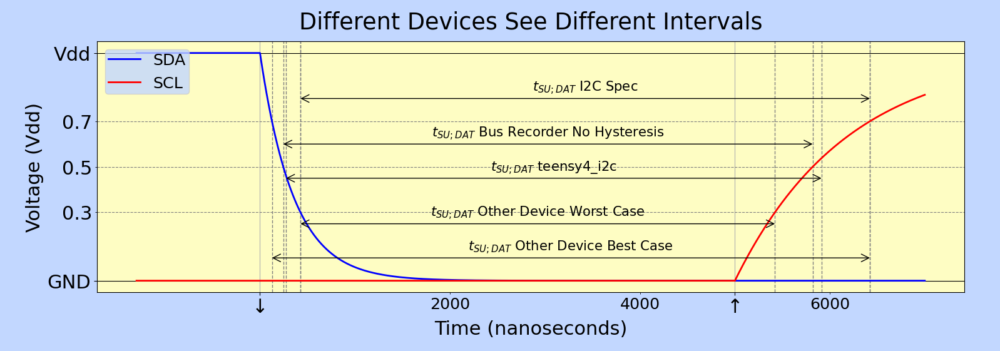

## How the I2C Specification Specifies Durations
When the I2C Specification specifies the time between 2 edges, it defines
the voltages at which the duration begins and ends. For example,
t<sub>HD;STA</sub> begins when SDA falls to 0.3 V<sub>dd</sub> and
ends when SCL falls to 0.7 V<sub>dd</sub>. You need to take account
of this if you measure an interval with an oscilloscope.

## How the Datasheet Defines Durations
Section `47.3.1.4 Timing Parameters` of the datasheet contains equations
that derive I2C Specification timing values from the register values
used to configure the `i.MX RT1062`. e.g. t<sub>HD;STA</sub>

These calculations are somewhat misleading. They appear to give the durations
that are defined in the I2C Specification, but they don't. The difference is
that the start and end of the durations are the points at which the CPU
changes a pin value. For example, for t<sub>SU;STO</sub>, the start is the
moment that SCL is released and starts to rise. The end is the point at which
SDA is released and starts to rise.

Similarly, the rise times used in the calculations are not equal to the I2C
Specification definitions. Instead, they are the time at which the CPU detects
an edge.

I'll describe the datasheet times as the "Datasheet Nominal" times. They are
shown on graphs as "Nominal: Datasheet".

The sections below contain the equations needed to map from nominal times to
I2C Specification times.

The datasheet takes a pragmatic approach that can be implemented and is not
affected by weird rise curves. The conversion equations assume that the rise
and fall times follow perfect RC curves.

## How the BusRecorder Measures Durations
The [BusRecorder](https://github.com/Richard-Gemmell/i2c-underneath/blob/main/documentation/tools/bus_recorder/bus_recorder.md)
is a tool from the [i2c-underneath](https://github.com/Richard-Gemmell/i2c-underneath) project.
It records the time between successive edges, but they're not quite the same
intervals as the I2C Specification.

This is because the `BusRecorder` fires when the voltage passes through 0.5 V<sub>dd</sub>.
If you configure its pins to use hysteresis then it actually fires a little
to either side of 0.5 V<sub>dd</sub>.

This difference is very significant if the rise times are large or very
different for SDA and SCL.

| Pin Mode       | Hysteresis | Edge     | Detected At                  | Value for Teensy |
|----------------|------------|----------|------------------------------|------------------|
| INPUT          | No         | Rising   | 0.5 V<sub>dd</sub>           | 1.650 V          |
| INPUT          | No         | Falling  | 0.5 V<sub>dd</sub>           | 1.650 V          |
| INPUT_DISABLE  | Yes        | Rising   | 0.5 V<sub>dd</sub> + 0.125 V | 1.775 V          |
| INPUT_DISABLE  | Yes        | Falling  | 0.5 V<sub>dd</sub> - 0.125 V | 1.525 V          |

## How I2CTimingAnalyser Reports Durations
The [I2CTimingAnalyser](https://github.com/Richard-Gemmell/i2c-underneath/blob/main/src/analysis/i2c_timing_analyser.h)
class analyses traces recorded by the `BusRecorder`. The results include the various
timings defined in the I2C Specification.

The `I2CTimingAnalyser` compensates for the fact that the `BusRecorder` captures
edges around 0.5 V<sub>dd</sub>. This relies on the assumption that the rise and
fall curves are perfect RC curves. The compensation will be unrealistic if
the bus does not behave like a perfect Resistor/Capacitor.

## When the i.MX RT1062 Detects Edges
The teensy4_i2c driver enables hysteresis on the I2C pins. Its trigger voltages
are the same as the `BusRecorder` with hysteresis. i.e. 0.538 V<sub>dd</sub> for
a rising edge and 0.462 V<sub>dd</sub> for a falling edge.

## When Other Devices Detect Edges
As mentioned above, devices are entitle to detect edges anywhere between
0.3 V<sub>dd</sub> and 0.7 V<sub>dd</sub>. This means that different
devices see these intervals differently.

The I2C Specification is written to account for this. For example,
t<sub>HD;DAT</sub> has a minimum duration but no maximum. It's defined so that
different devices will see only slightly longer durations than expected.

The only exceptions to this rule are t<sub>VD;DAT</sub> and t<sub>VD;ACK</sub>.
These are defined as maximum durations starting with a falling edge on SCL.
A device can see a slightly longer duration than expected by reading the
falling edge early. As of Nov 2022, I'm not sure if this is significant or not.

# i.MX RT 1060 Registers
## LPI2C Clock
* CCM_CSCDR2 `14.7.13 CCM Serial Clock Divider Register 2 (CCM_CSCDR2)`
  - LPI2C_CLK_SEL
    - selects the base clock speed
    - 0 for pll3_sw_clk at 60 MHz clock
    - 1 for osc_clk at 24 MHz
  - LPI2C_CLK_PODF
    - LPI2C clock divider

## I2C Master Registers
* MCFGR1 `47.5.1.9 Master Configuration 1 (MCFGR1)`
  - PRESCALE
    - multiplier applied to all other master settings except FILTSDA and FILTSCL
* MCCR0 `47.5.1.13 Master Clock Configuration 0 (MCCR0)`
  - CLKLO
    - affects t<sub>low</sub> low period of the SCL clock pulse
  - CLKHI
    - affects t<sub>high</sub> high period of the SCL clock pulse
  - DATAVD
    - affects t<sub>HD;DAT</sub> data hold time
  - SETHOLD
    - affects t<sub>HD;STA</sub> hold time for START condition
    - affects t<sub>SU;STA</sub> setup time for repeated START condition
    - affects t<sub>SU;STO</sub> setup time for STOP condition
* MCFGR2 `47.5.1.10 Master Configuration 2 (MCFGR2)`
  - FILTSDA
    - affects t<sub>SP</sub> spike suppression on SDA line
    - not affected by PRESCALE
  - FILTSCL
    - affects t<sub>SP</sub> spike suppression on SCL line
    - not affected by PRESCALE
  - BUSIDLE
    - affects t<sub>BUF</sub> minimum bus free time between a STOP and START condition
* MCFGR3 `47.5.1.11 Master Configuration 3 (MCFGR3)`
  - PINLOW
    - configures pin low timeout
    - used to detect a stuck bus

## I2C Slave Registers
TODO: Not finished

# I2C Timing Parameters and Calculations
## Variables Defined in i.MX RT1062 Datasheet
These variables are defined in the datasheet. The datasheet uses them
as intermediate variables in the I2C timing equations.

See Table 47-6 in `47.3.2.4 Timing Parameters` for the master calculations.

### SCALE
> SCALE = (2 ^ PRESCALE) x t<sub>LPI2C</sub>

### SDA_RISETIME
Given t<sub>rt(SDA)</sub> = time for SDA to rise to the trigger voltage
then the rise time in LPI2C clock cycles is
> SDA_RISETIME = t<sub>r;SDA</sub> / t<sub>LPI2C</sub>

### SCL_RISETIME
Given t<sub>rt(SCL)</sub> = time for SCL to rise to the trigger voltage
then the rise time in LPI2C clock cycles is
> SCL_RISETIME = t<sub>r;SCL</sub> / t<sub>LPI2C</sub>
 
### SDA_LATENCY
> SDA_LATENCY = ROUNDDOWN ( (2 + FILTSDA + SDA_RISETIME) / (2 ^ PRESCALE) )

### SCL_LATENCY
> SCL_LATENCY = ROUNDDOWN ( (2 + FILTSCL + SCL_RISETIME) / (2 ^ PRESCALE) )

## SCL Clock Frequency
### f<sub>SCL</sub> SCL Clock Frequency
The frequency is the inverse of the period t<sub>LPI2C</sub>. I'll describe everything
in terms of the period as that's what we control and measure.

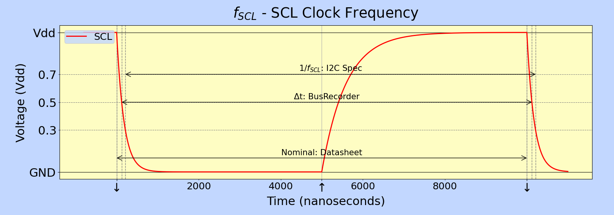

#### Equations
> nominal = (CLKHI + CLKLO + 2 + SCL_LATENCY) x scale
>
> f<sub>SCL</sub> = 1 / nominal

#### Notes
* controlled entirely by the master device
* NOT the same as adding the clock HIGH and clock LOW periods

#### I2C Specification
* starts when SCL falls to 0.3 V<sub>dd</sub>
* ends when SCL falls to 0.3 V<sub>dd</sub> for a second time
* specifies a maximum frequency (i.e. a minimum period)

#### Datasheet Nominal
Behaviour:
* the processor pulses SCL regularly

#### Other Device Worst Case
* the `i.MX RT1062` does not compensate for the SCL rise time
* the worst case scenario is that the SCL rise time is very fast

### t<sub>LOW</sub> LOW Period of the SCL Clock
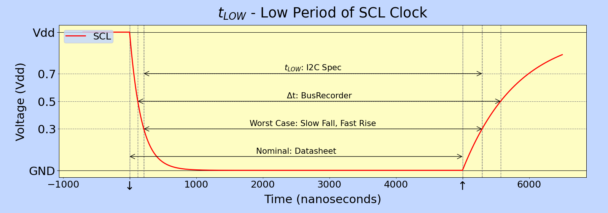

#### Equations
> nominal = (CLKLO + 1) x scale
>
> t<sub>LOW</sub> = nominal - t<sub>fL;SCL</sub> + t<sub>rL;SCL</sub>

#### Notes
* controlled entirely by the master device
* confirmed that it's not affected by:
  - FILTSCL
  - FILTSDA
  - CLKHI
  - DATAVD
  - SETHOLD
  - IOMUXC_PAD_HYS

#### I2C Specification
* starts when SCL falls to 0.3 V<sub>dd</sub>
* ends when SCL rises to 0.3 V<sub>dd</sub>
* defines a minimum value but not a maximum
  - this allows the bus to be slower than the nominal speed.
    e.g. running a Standard-mode bus at 50 kHz.

#### Datasheet Nominal
Behaviour:
* the processor
  * pulls SCL low
  * waits for a fixed time
  * then releases SCL again
* there's no compensation for rise or fall times

#### Other Device Worst Case
The worst case scenario is that SCL has a slow fall time and a very fast
rise time. The fall time is controlled entirely by the `i.MX RT1062`and is
very short so this isn't significant.

### t<sub>HIGH</sub> HIGH Period of the SCL Clock
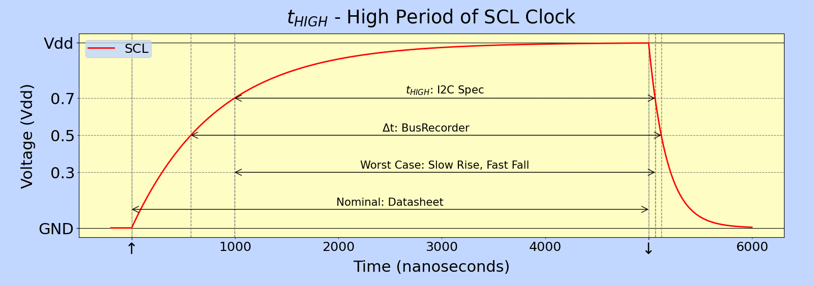

#### Equations
> nominal = (CLKHI + 1 + SCL_LATENCY) * scale
>
> t<sub>HIGH</sub> = nominal - t<sub>rH;SCL</sub> + t<sub>fH;SCL</sub>

#### Notes
* controlled entirely by the master device
* fall time can be neglected
* there's a minimum value but no maximum value
* confirmed that t<sub>high</sub> is also affected by:
  * IOMUXC_PAD_HYS
* confirmed that t<sub>high</sub> is not affected by:
  - FILTSDA
  - CLKLO
  - DATAVD
  - SETHOLD
  - BUSIDLE

#### I2C Specification
* starts when SCL rises to 0.3 V<sub>dd</sub>
* ends when SCL falls to 0.7 V<sub>dd</sub>
* defines a minimum value but not a maximum
  - this allows the bus to be slower than the nominal speed. e.g.
    running a Standard-mode bus at 50 kHz.

#### Datasheet Nominal
Behaviour:
* the processor
  * release SCL
  * waits for SCL to rise to the trigger voltage (just over 0.5 V<sub>dd</sub>)
  * waits for fixed time
  * pulls SCL LOW again
* there's no compensation for the SCL fall time but this is short and can be
  neglected

#### Other Device Worst Case
The worst case scenario is that SCL has a slow rise time and a very fast
fall time. The fall time is controlled entirely by the `i.MX RT1062`and is
very short so this isn't significant.

## Start and Stop Conditions
### t<sub>SU;STA</sub> Setup Time for a Repeated START Condition
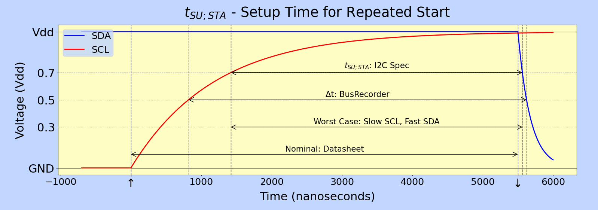

#### Equations
> nominal = (SETHOLD + 1 + SCL_LATENCY) x scale
>
> t<sub>SU;STA</sub> = nominal - t<sub>rH;SCL</sub> + t<sub>fH;SDA</sub>

#### Notes
* controlled entirely by the master device
* fall time can be neglected
* there's a minimum value but no maximum value

#### I2C Specification
* occurs during a repeated START
  - a repeated START allows the master to send another message without sending a STOP
  - this reduces latency as there's no need for the STOP or "bus free time" periods
* starts when SCL rises to 0.7 V<sub>dd</sub>
* ends when SDA falls to 0.7 V<sub>dd</sub>

#### Datasheet Nominal
Behaviour:
* the processor releases the SCL pin allowing SCL to rise
* when it detects that SCL has risen it waits for a time derived from SETHOLD
  * this provides limited compensation for different rise times
* when the time has passed it pulls SDA low

Definition:
* starts when the master releases SCL and it starts to rise
  * i.e. master sets SCL pin to 1
* ends when the master pulls SDA LOW and it starts to fall
  * i.e. master sets SDA pin to 0

Sensitivity to SCL rise time:
* for a fixed SETHOLD
  - the setup time falls as the rise time increases
  - the setup time increases as FILTSCL increases

#### Other Device Worst Case
* the `i.MX RT1062` does not compensate for the whole SCL rise time
* so the worst case scenario is that the SCL rise time is very long and
  the SDA fall time is very short
* the fall time is controlled by the `i.MX RT1062` and is very short.
  This means the fall time has a negligible effect and can be ignored.

### t<sub>HD;STA</sub> Hold Time for a START or Repeated START Condition
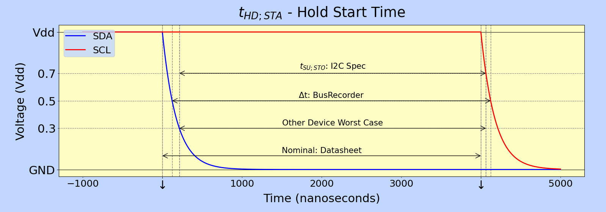

#### Equations
> nominal = (SETHOLD + 1) x scale
>
> t<sub>HD;STA</sub> = nominal - t<sub>fL;SDA</sub> + t<sub>fH;SCL</sub>

#### Notes
* Controlled entirely by the master device.
* Fall time can be neglected.

#### I2C Specification
* occurs during a START
* starts when SDA falls to 0.3 V<sub>dd</sub>
* ends when SCL falls to 0.7 V<sub>dd</sub>

#### Datasheet Nominal
In theory, the fall time, t<sub>f</sub>, might affect the calculation.
In practice, it doesn't matter because this calculation is only relevant
when the Teensy is acting as a master. In that mode, the fall times are
set by the Teensy. They're very fast so they can't have any significant
effect.

#### Other Device Worst Case
* according to the datasheet, the `i.MX RT1062` does not compensate for
  the fall times of SDA or SCL
* for a particular set of register settings the worst case scenario is that
  the SDA fall time is very long and the SCL fall time is very short
* both of these edges are controlled by the `i.MX RT1062` itself and they're
  both very short (< 8 ns) and nearly identical
* it's therefore safe to ignore the worst case scenario when configuring
  the device

### t<sub>SU;STO</sub> Setup Time for STOP Condition
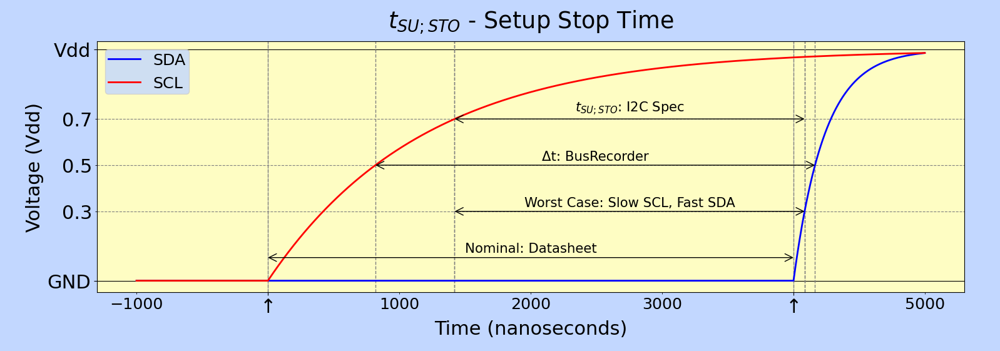

#### Equations
> nominal = (SETHOLD + 1 + SCL_LATENCY) x scale
>
> t<sub>SU;STO</sub> = nominal - t<sub>rH;SCL</sub> + t<sub>rL;SDA</sub>

#### Notes
* controlled entirely by the master device

Confirmed it depends on:
* PRESCALE
* SCL rise time
* FILTSCL

Confirmed it does not depend on:
* FILTSDA

#### I2C Specification
* occurs before a STOP
* starts when SCL rises to 0.7 V<sub>dd</sub>
* ends when SDA rises 0.7 V<sub>dd</sub>
* there's a minimum value but no maximum value

#### Datasheet Nominal
Behaviour:
* the processor releases the SCL pin allowing SCL to rise
* when it detects that SCL has risen it waits for a time derived from SETHOLD
  * this provides limited compensation for different rise times
* when the time has passed it releases SDA allowing SDA to rise

Definition:
* starts when the master releases SCL and it starts to rise
  * i.e. master sets SCL pin to 1
* ends when the master releases SDA and it starts to rise
  * i.e. master sets SDA pin to 1

Sensitivity to SCL rise time:
* for a fixed SETHOLD
  - the setup time falls as the rise time increases
  - the setup time increases as FILTSCL increases

#### Other Device Worst Case
* the `i.MX RT1062` does not compensate for the whole SCL rise time
* so the worst case scenario is that the SCL rise time is very long and
  the SDA rise time is very short

### t<sub>BUF</sub> Bus Free Time Between a STOP and START Condition
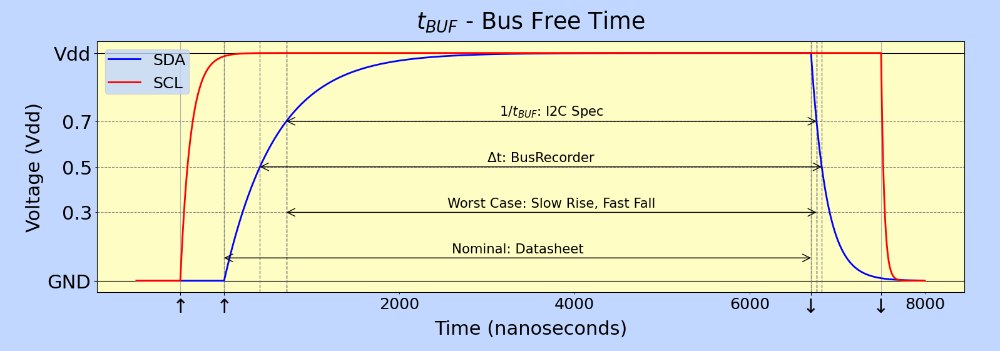

#### Equations
WARNING: The actual behaviour of the `i.MX RT1062` is significantly different
to the equations given in `47.3.1.4 Timing Parameters`.

```
time_to_rise_to_0_7_vdd = 1.421
time_to_fall_to_0_7_vdd = 0.421
if SDA_RISETIME > 1000:
  offset = 1 + ((SDA_RISETIME - 1000) * time_to_rise_to_0_7_vdd) / SCALE
else:
  offset = 2
  if BUSIDLE > 1
    offset = BUSIDLE + 1
nominal = 1000 + SCALE * (CLKLO + 1 + offset)
tBUF = nominal - (SDA_RISETIME * time_to_rise_to_0_7_vdd) + (tf * time_to_fall_to_0_7_vdd)
```

#### Notes
* controlled entirely by the master device
* t<sub>BUF</sub> does NOT behave as described in the datasheet
  * does NOT depend on FILTSDA
  * does not appear to depend on SDA_LATENCY at all
  * behaviour is qualitatively different when SDA_RISETIME > 1000 nanoseconds
  * the equations above were deduced by fitting measured results
* BUSIDLE does NOT behave as described in the datasheet
  * the minimum value given in `47.3.1.4 Timing Parameters` doesn't seem to matter
  * BUSIDLE is ignored when set to 0
  * BUSIDLE does not affect t<sub>BUF</sub> when SDA_RISETIME > 1000 nanoseconds
  * BUSIDLE increases t<sub>BUF</sub> when SDA_RISETIME < 1000 nanoseconds
  * Setting BUSIDLE to 0 does not prevent the driver from deciding that the
    bus is idle if another master aborts a transaction without a STOP condition

#### I2C Specification
* occurs between a STOP and a START
* SCL is released during the STOP condition
* starts when SDA rises to 0.7 V<sub>dd</sub>
* ends when SDA falls to 0.7 V<sub>dd</sub>
* there's a minimum value but no maximum value

#### Datasheet Nominal
Behaviour:
* the processor releases the SDA pin allowing SDA to rise (STOP condition)
* waits for a period of time which is a function CLKLO and BUSIDLE
* pulls SDA LOW again (START condition)

Definition:
* starts when the master releases SDA, and it starts to rise
  * i.e. master sets SCL pin to 1
* ends when the master pulls SDA LOW, and it starts to fall
  * i.e. master sets SDA pin to 0

#### Other Device Worst Case
* the `i.MX RT1062` does not compensate for the whole SDA rise time
* so the worst case scenario is that the SDA rise time is very long and
  the SDA fall time is very short
* the fall time is controlled by the `i.MX RT1062` and is very short.
  This means the fall time has a negligible effect and can be ignored.


## Data Bits
### t<sub>SU;DAT</sub> Data Setup Time
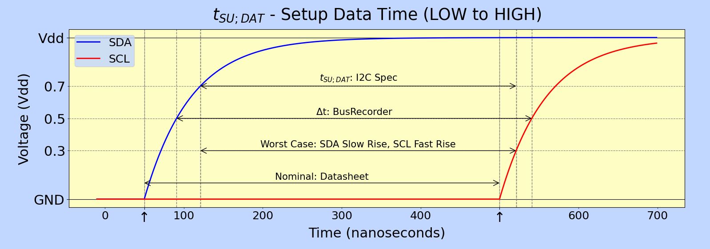
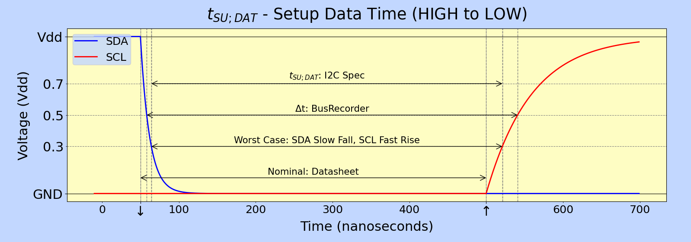

#### Equations
> t<sub>LOW</sub> = t<sub>VD;DAT</sub> + t<sub>SU;DAT<sub>

#### Notes
* controlled by the master if it's transmitting
* could be controlled by the master when the slave is transmitting
  but the master cannot guarantee this time as the slave could change
  SDA *after* the master starts to change SCL

#### I2C Specification
* defined as the minimum time allowed between SDA changing value and SCL starting to rise
* starts when SDA reaches a new value
  * if SDA rises then time starts at 0.7 V<sub>dd</sub>
  * if SDA falls then time starts at 0.3 V<sub>dd</sub>
* ends when SDA rises to 0.3 V<sub>dd</sub>
* the spec doesn't say whether this applies to ACKs or the setup to a STOP
  bit. I assume it does as SDA needs to be stable in these cases as well.

#### Datasheet Nominal
* read description of [t<sub>HD;DAT</sub>](#tsubhddatsub-data-hold-time) first
* t<sub>SU;DAT</sub> is not controlled directly by the driver
  * when the master is transmitting then it's a side effect of t<sub>VD;DAT</sub>
  * when a slave transmits then it's determined by when the slave changes
    SDA. The master probably toggles SCL on schedule regardless.

#### Other Device Worst Case
* if SDA is rising, then the worst case occurs when the SDA rise time is very large
* if SDA is falling, then the worst case is when the SDA fall time is very large
  * SDA might be controlled by a slave device with a long fall time
  * if the Teensy is the master then the worst case is identical to the I2C value
    as the Teensy controls the fall time
* in either case, the worst case happens when the SCL rise time is fast

### t<sub>HD;DAT</sub> Data Hold Time
The data hold time applies whether SDA changes from HIGH to LOW or vice versa.
The first of these graphs shows SDA rising and the second shows SDA falling.

We know that SCL will fall very fast for a Teensy in master mode as it controls
SCL. A Teensy slave might see a very slow falling edge. These 2 graphs highlight
this difference.

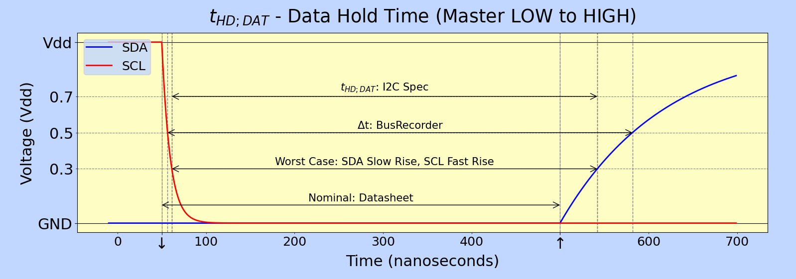
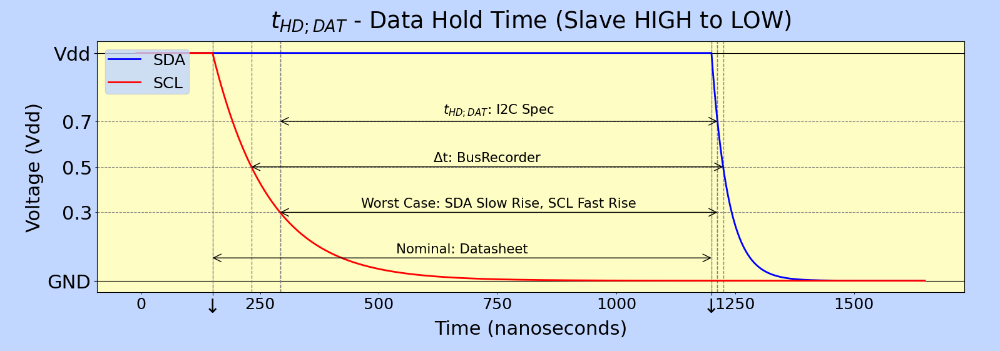

#### Equations
##### Master Controls SDA
> nominal = (DATAVD + 1) x scale
>
> t<sub>HD;DAT</sub> = nominal - t<sub>fL;SCL</sub> + (t<sub>rL;SDA</sub> **or** t<sub>fH;SDA</sub>)

t<sub>fL;SCL</sub> is negligible on the Teensy and can be ignored in practice

##### Slave Controls SDA
given t<sub>ft;SCL</sub> is time to for SCL to fall from the trigger voltage to 0.3 V<sub>dd</sub>
> nominal = (FILTSCL + DATAVD + 3) x t<sub>LPI2C</sub>
>
> t<sub>HD;DAT</sub> = nominal - t<sub>f;SCL</sub> + (t<sub>rL;SDA</sub> **or** t<sub>fH;SDA</sub>)

#### Notes
* the data hold time is determined by whichever device is changes SDA
* the data hold time ensures that a device never sees SDA change unless SCL is LOW
* note 3 of Table 10 of `I2C Spec. 6.1 Electrical specifications and timing for I/O stages and bus lines`
  refers to an "internal" hold time. This is necessary to avoid the edge case where
  SCL has a very slow fall time and SDA changes very fast. If one device decides
  that SCL fell at 0.65 V<sub>dd</sub> and changes SDA, but the other device
  doesn't decide SCL fell until it reaches 0.35 V<sub>dd</sub>, then the second
  device could see the change on SDA before the change in SCL. This can't happen
  if the first device waits for the maximum fall time before changing SDA.
* in the edge case above, the "external" data hold time is negative
* a slave device can probably get away with a very short or 0 length hold time. 
  The master pulled SCL LOW and so presumably thinks SCL is LOW irrespective
  of the fall time. It will almost certainly see any change to SDA as happening
  when SCL is LOW irrespective of how fast the slave reacts.

#### I2C Specification
* time starts when SCL falls to 0.3 V<sub>dd</sub>
* time ends when SDA starts to change. i.e. rises to 0.3 V<sub>dd</sub> or falls
  to 0.7 V<sub>dd</sub>
* the I2C Specification doesn't make it clear whether the hold time applies
  after the START bit and before the STOP bit. I assume it does, because the
  purpose of the data hold time is to make sure that data bits are not confused
  with STOP or START bits.

#### Datasheet Nominal
There are 2 different conditions. In the first case, the Teensy is the master
device, and it controls SDA. In the second, the Teensy is the slave device, and
it controls SDA.

Note that the Teensy configures DATAVD separately for master and slave modes.

##### Master Controls SDA
* starts when the processor pulls SCL LOW and SCL starts to fall
* the processor waits for a period of time which depends on DATAVD
* ends when the processor changes the value of SDA pin and SDA starts to change

##### Slave Controls SDA
* starts when the processor detects that SCL has fallen (approx
  0.5 V<sub>dd</sub> on the Teensy)
* the processor waits for a period of time which depends on DATAVD
* ends when the processor changes the value of SDA pin and SDA starts to change

#### Other Device Worst Case
##### Master Controls SDA
The worst case occurs when SCL falls very slowly and SDA changes very fast.
Fall times are usually much faster than rise times, so this probably involves
SDA falling.

##### Slave Controls SDA
The worst case also happens when SCL falls very slowly and SDA changes very
fast. It probably doesn't matter though because the master already thinks SCL
is LOW and so can't confuse the order of the edges.

### t<sub>VD;DAT</sub> Data Valid Time
t<sub>VD;DAT</sub> is identical to t<sub>HD;DAT</sub> except that includes the
time for SDA to finish changing. Please read the section for 
[Data Hold Time](#tsubhddatsub-data-hold-time) first.

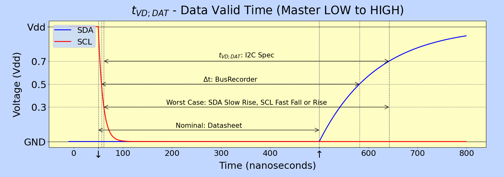
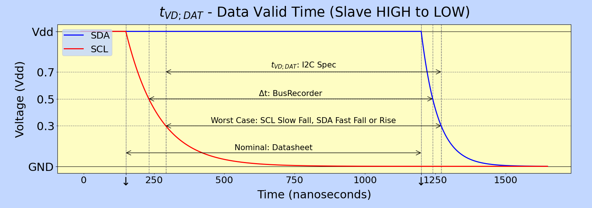

#### Equations
The nominal time is identical to the nominal for t<sub>HD;DAT</sub>. The I2C
time is identical to the I2C time for t<sub>HD;DAT</sub> plus the SDA rise time
if SDA is rising, or the fall time if SDA is falling.

##### Master Controls SDA
> nominal = (DATAVD + 1) x scale
>
> t<sub>VD;DAT</sub> = t<sub>HD;DAT</sub> + (t<sub>f<sub> or t<sub>r</sub>)

##### Slave Controls SDA
given t<sub>ft;SCL</sub> is time to for SCL to fall from the trigger voltage to 0.3 V<sub>dd</sub>
> nominal = (FILTSCL + DATAVD + 3) x t<sub>LPI2C</sub>
>
> t<sub>VD;DAT</sub> = t<sub>HD;DAT</sub> + (t<sub>f<sub> or t<sub>r</sub>)

#### Notes
* the I2C Specification sets a maximum value for data valid time. It doesn't
  explain why this is required.
* the limitation on t<sub>VD;DAT</sub> applies only if the clock is not stretched
* t<sub>VD;ACK</sub> is identical to t<sub>VD;DAT</sub> except that it applies
  to ACKs instead of data bits
* t<sub>LOW</sub> = t<sub>VD;DAT</sub> + t<sub>SU;DAT<sub>

## ACKs and Spikes
### t<sub>VD;ACK</sub> Data Valid Acknowledge Time
t<sub>VD;ACK</sub> is identical to t<sub>VD;DAT</sub> except that it
applies to an ACK rather than a data bit.

### t<sub>SP</sub> Pulse Width of Spikes that must be Suppressed by the Input Filter
#### Equations
#### Notes
#### I2C Specification
#### Datasheet Nominal
#### Other Device Worst Case

~~~~~~~~
#### Notes
#### I2C Specification
#### Datasheet Nominal
