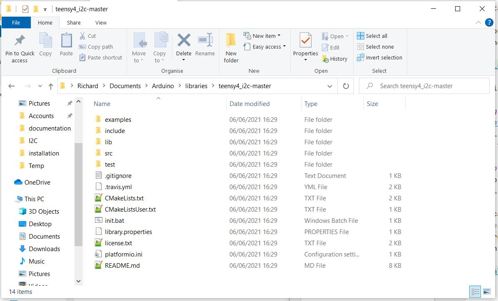

# Arduino Installation
These instructions explain how to use this library with the [Arduino IDE](https://www.arduino.cc/en/software).

1. [Download](https://github.com/Richard-Gemmell/teensy4_i2c/archive/refs/heads/master.zip)
the zip of the master branch.
1. Install teensy4_i2c as a "custom library" using the [standard Arduino instructions](https://www.arduino.cc/en/Guide/Libraries#importing-a-zip-library)

Once you've installed the library you can pick one of the examples
from the bottom of the "File | Examples" drop menu.

The "wire | find_slaves" example should work without changes.

# Using Another Branch 
See [Getting Code out of GitHub](github_help.md) if you want to
install a different branch. (You wouldn't normally do this unless
you're trying out a bug fix or pre-release version.)

# Troubleshooting
Arduino should add the library to your "Sketchbook location" directory.
It will include the entire contents of the teensy4_i2c project.

In my case this directory is
`C:\Users\Richard\Documents\Arduino\libraries`.

