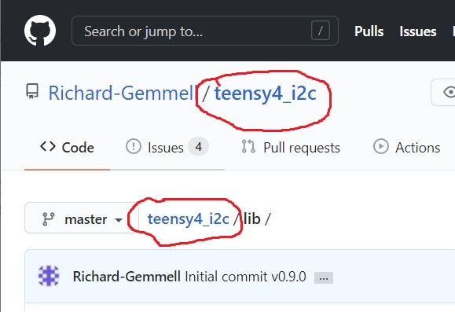
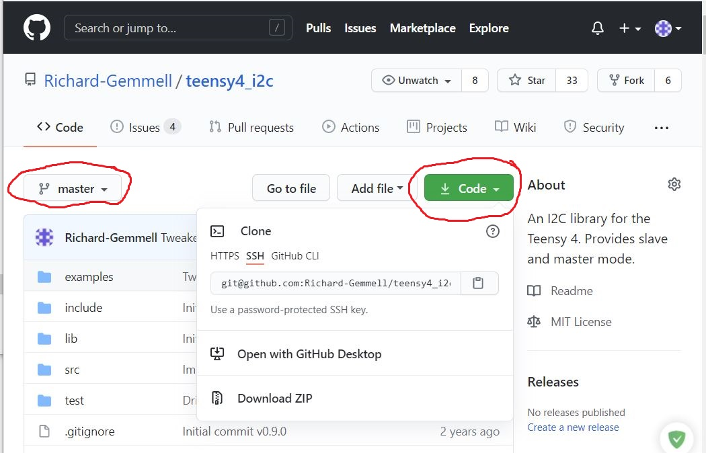

# Getting Code out of GitHub

If you're not used to GitHub (or Git!) then getting code out
of GitHub can be pretty confusing.

## Downloading a Whole Project
There are 2 ways to download an entire project. You can either
download a ZIP or use Git to clone the project.

Whichever method you use, you need to use the find the "Code"
button. This is a big green button that appears on the project's
home page.

If you're not on the home page you can use any of the links that
contain the project name. That's `teensy4_i2c` in these examples.

Click the green "Code" button. Select "Download ZIP" to download
a zip file containing the project.

If you're using git, you can get the git repository URL from the
drop down menu.

## Using Branches
"Branches" contain different versions of the code. If you want
to download a ZIP for a differnt branch then use the drop down
on the left hand side of the screen to change branch before
clicking the "Code" button. The example above is showing the
"master" branch.