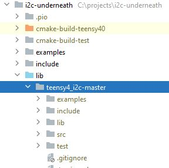

# Platform IO Installation

[Download](https://github.com/Richard-Gemmell/teensy4_i2c/archive/refs/heads/master.zip)
the zip of the master branch. Unzip it into the `lib` directory of your PIO project.

The directory tree should look something like this:

You may need to reinitialise your project to make your IDE notice the new library. (i.e. run
`pio init` with the correct arguments for your project.)

See [Getting Code out of GitHub](github_help.md) if you want to
install a different branch. (You wouldn't normally do this unless
you're trying out a bug fix or pre-release version.)