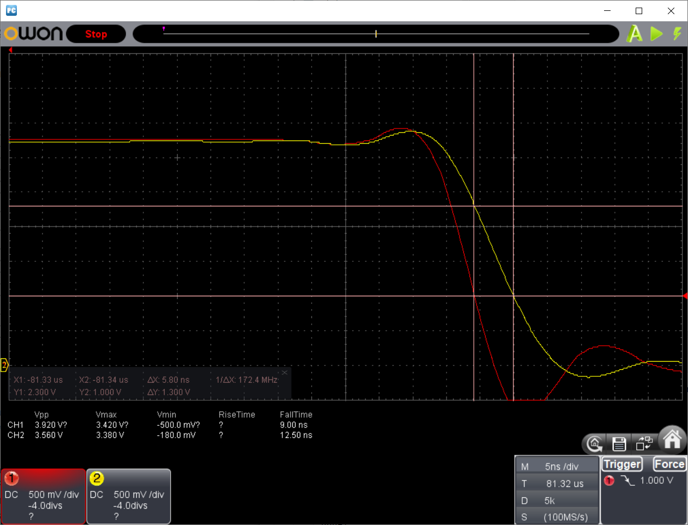
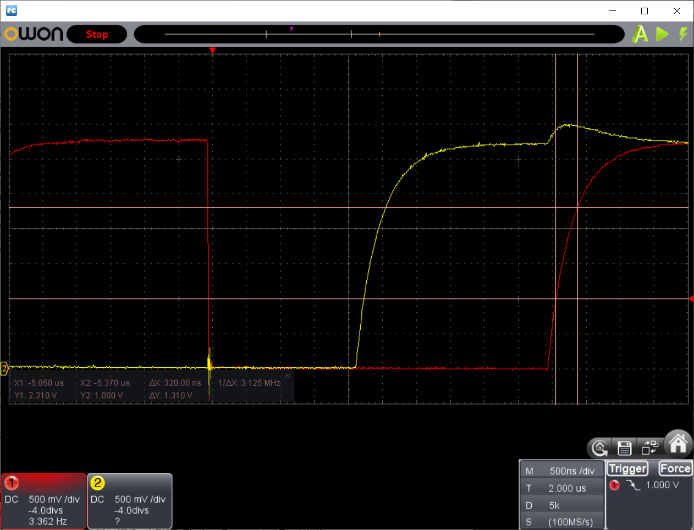
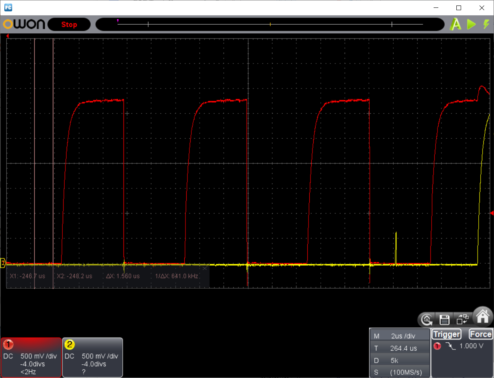
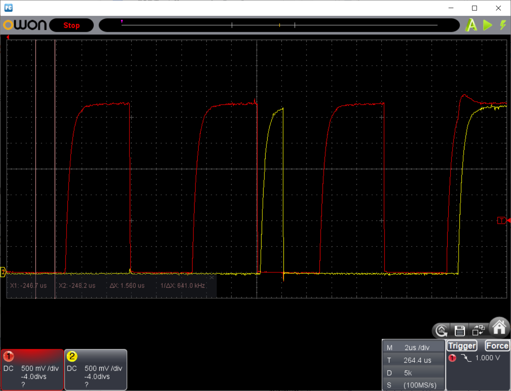
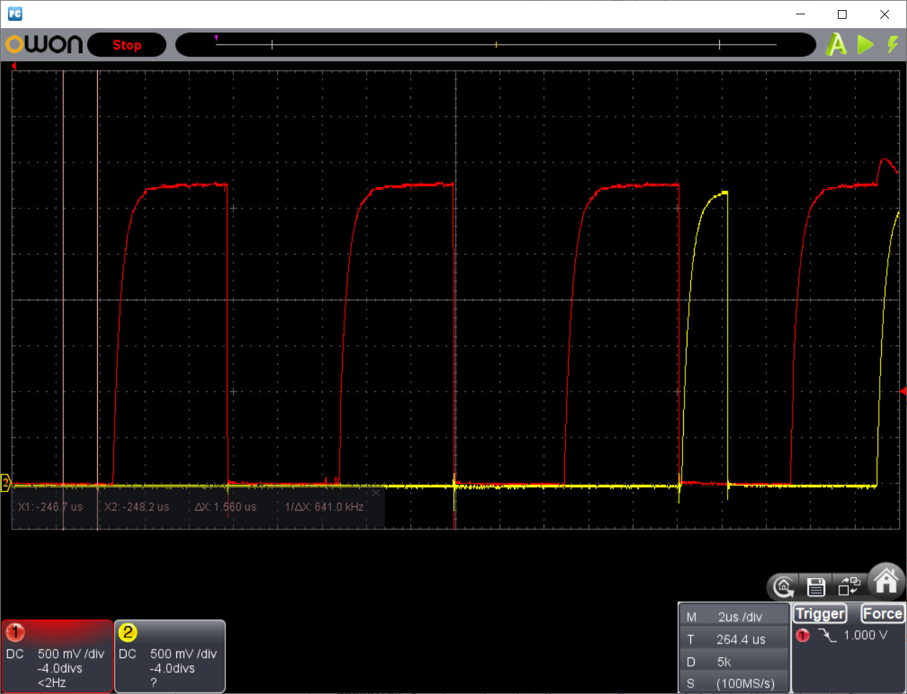

# Observations and Measurements

# Teensy 4 Loopback
## Test Configuration
* Master - Teensy 4 I2C port 0
* Slave - Teensy 4 I2C port 1 on the same device
* All I2C pins configured to use internal 22 kΩ pullups
* Owon VDS 1022 25 MHz oscilloscope hooked on to pins 22 (SCL) and 23 (SDA)
* Pins 22 and 23 are configured as INPUT_PULLUP and used to capture a trace.
  * these have a pullup of ? kΩ which makes the rise time faster
* Measurements taken with oscilloscope unless stated otherwise

## Findings
### Fall Time (tf)
According to the I2C specification, the fall time is the time taken for
a line to fall from 0.7 Vdd to 0.3 Vdd. This is
called tf in the spec.

* SCL fall time < 6 ns
* SDA fall time < 6 ns

These times are less than the resolution of the oscilloscope so could
be much less than 6 ns.

### Hold Time (tHD;DAT)
See image for fall times.
* minimum approx 5 ns

### Rise Time (tr)
According to the I2C specification, the rise time is the time taken for
a line to rise from 0.3 Vdd to 0.7 Vdd. This is
called tr in the spec.

* SCL rise time approx 320 ns
* SDA rise time approx 320 ns

## SDA Pulses While SCL is LOW
The I2C specification defines the `Receiver` as the device which receives data
from the bus. The device that writes data to the bus is called the `Transmitter`.

The receiver reads SDA only when SCL is HIGH. Both parties are free to fiddle
with SDA while SCL is LOW. This can cause SDA to pulse while SCL is LOW. These
pulse are implementation dependent and should be ignored. They are irrelevant
to the I2C logic.

### Same Transmitter
If the transmitter is writing consecutive bits with the same value then it's free
to hold SDA constant. For example, in the bit sequence 000, SDA may remain low for
the entire clock cycle for the middle bit. This is what the Teensy 4 does.

A transmitter can release SDA shortly after SCL goes LOW if it chooses. If it then
needs to pull SDA LOW again it'll create a pulse while SCL is LOW. This is
perfectly valid. (Although I haven't seen it happen with the Teensy 4.)

### Changing Transmitter
When control of SDA passes from one device to the other, then the first device is
required to release SDA so that the second device can control it. Remember that a
line is LOW if *any* device pulls it LOW. It's only HIGH if *every* device sets it
to float HIGH.

If the first device had set SDA LOW and the second device also wishes
to set it LOW then SDA may spike briefly from LOW to HIGH to LOW. This
only happens in the LOW part of the clock cycle.

The I2C specification requires devices to set the value of SDA a certain time
before SCL rises. They are allowed to hold it for a certain time after SCL falls
again. These are called the `setup` and `hold` times respectively. A device won't
attempt to change SDA during the hold time. This doesn't stop the other device
from changing it though.

SDA will only spike if the first device's hold time is shorter than the second
device's hold time.

Compare these 2 traces showing SCL in red and SDA in yellow.
They both show the end of a message in which the master transmitted
0xFF. The trace contains the last 2 bits of the data byte to the left. (They're both 0.)
The right side shows the slave sending an ACK and then the master sending a STOP condition.

In this first case, the master's hold time is longer than the slave's. There's no SDA pulse.

In the second case, the master's hold time is shorter than the slave so SDA pulses HIGH
during the ACK cycle.

In this final case, the master's hold time is very long and the slave's is virtually zero.
Recall that the slave writes SDA for the ACK but the master writes the STOP condition. This
is another place where control changes from one device to the other and again we get an
SDA pulse.

## Effects of Series Resistors
Series resistors are claimed to:
* raise the minimum voltage of the line
  * can help with debugging clock stretching etc
* reduce undershoots caused by SCL falling
* increase tfall
  * useful as Teensy fall time is too fast

### Findings
Experiments were done with IOMUXC_PAD_DSE(4) unless stated otherwise.

* 10Ω resistor
  * raise minimum voltage from 70 mV to 110 mV
  * no significant effect on undershoots
  * had no measurable effect on tfall
* 100Ω resistor
  * raise minimum voltage as high as 530 mV with 1kΩ pullup
    * not acceptable for I2C but smaller pullup should be Ok
  * eliminated undershoots caused by SCL falling
    * overshoots caused by coupling with SDA falling did not fall below 0 V
  * maybe increases tfall by 2 ns to 10 ns if DSE is set to 1
* 200Ω series resistor + 1kΩ pullup
  * raise minimum voltage from 70 mV to 640 mV with 1kΩ pullup
    * not acceptable for I2C but smaller pullup should be Ok
  * eliminated undershoots caused by SCL falling
  * increased tfall to 18 ns
    * effect disappears if external pullup is removed

### Conclusion
On the Teensy series resistors are:
* do not increase tfall significantly
* reduce undershoot spikes but shouldn't be necessary
* are useful for debugging oscilloscope traces
* can easily raise the logic LOW level high enough to break I2C

In short: not recommended except for debugging